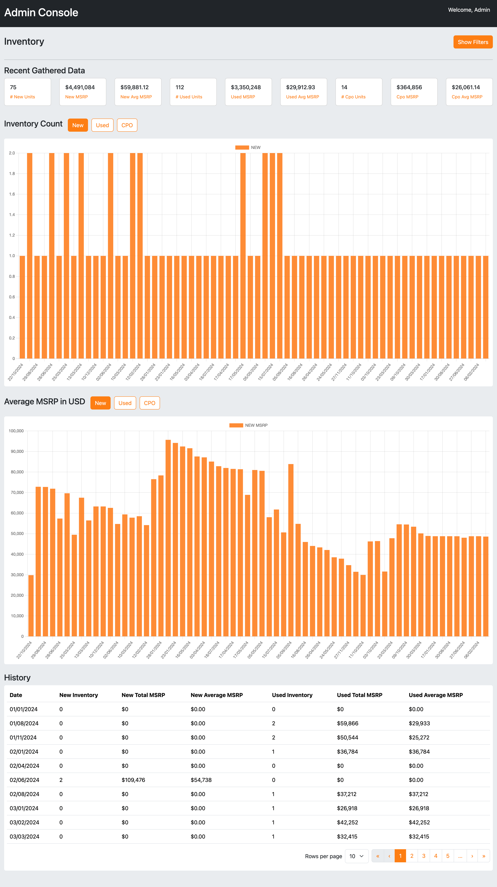

# Inventory Dashboard


## Project Structure

The project is organized into two main parts: `frontend` and `backend`.
```
/root
|-- /public
|-- /src
|   |-- /components
|   |-- /redux
|   |-- /styles
|   |-- App.js
|   |-- index.js
|-- /server
|   |-- /routes
|   |-- /db
|   |-- /models
|   |-- server.js
|-- package.json
|-- README.md
```

### Frontend

- **/src/components**: Contains React components used to build the dashboard.
- **/src/redux**: Contains Redux store setup and slices for managing application state.
- **/src/styles**: Styling files for the application.
- **App.js**: Main component for rendering the application.
- **index.js**: Entry point for the React application.

### Backend ('./server')

- **/routes**: Contains Express route definitions.
- **/models**: Contains Data fetcher.
- **/db**: Sample data file (`inventory.csv`) used for mock inventory data.
- **server.js**: Entry point for the Express server.

## Backend (Express API)

### API Endpoint

**Endpoint:** `/api/inventory`

**Method:** `GET`

#### Query Parameters

- `make` (optional): Filters data by vehicle make.
- `duration` (optional): Filters data by date duration. Available options include:
  - `lastMonth`
  - `thisMonth`
  - `last3Months`
  - `last6Months`
  - `thisYear`
  - `lastYear` (if applicable)

#### Response Format

The API responds with a JSON array containing inventory data objects. Each object includes the following fields:

- `condition`: Condition of vehicle (NEW, USED, CPO).
- `description`: A brief description of the vehicle, specifying it as a new 2024 model of the GMC Terrain.
- `title`: The specific title or name given to this vehicl.
- `brand`: The brand or manufacturer of the vehicle, in this case, GMC.
- `price`: The price of the vehicle in United States Dollars (USD).
- `product_type`: The category or type of vehicle.
- `timestamp`: The date and time when this vehicle's information was added to the inventory system.

Example Response:

```
[
    {
        "condition":"new",
        "description":"New 2024 GMC Terrain",
        "title":"New 2024 GMC Terrain SLE",
        "brand":"GMC",
        "price":29829,
        "product_type":"SUV",
        "custom_label_0":"Terrain",
        "timestamp":"2024-10-22T17:31:03.000Z"
    },
    {
        "condition":"new",
        "description":"New 2024 GMC Yukon XL",
        "title":"New 2024 GMC Yukon XL AT4",
        "brand":"GMC",
        "price":73767,
        "product_type":"SUV",
        "custom_label_0":"Yukon XL",
    }
  ...
]
```

## Project Setup and Running

**Install dependencies:**
```
npm install
```

### Backend Setup

1. **Navigate to the server directory.**
      
2. **Start the Express server:**
   ```
   node server.js
   ```
   
   The server will run on `http://localhost:8080`.

### Frontend Setup
      
1. **Start the React development server:**
   ```
   npm start
   ```
   
   The application will open in your default browser at `http://localhost:3000`.